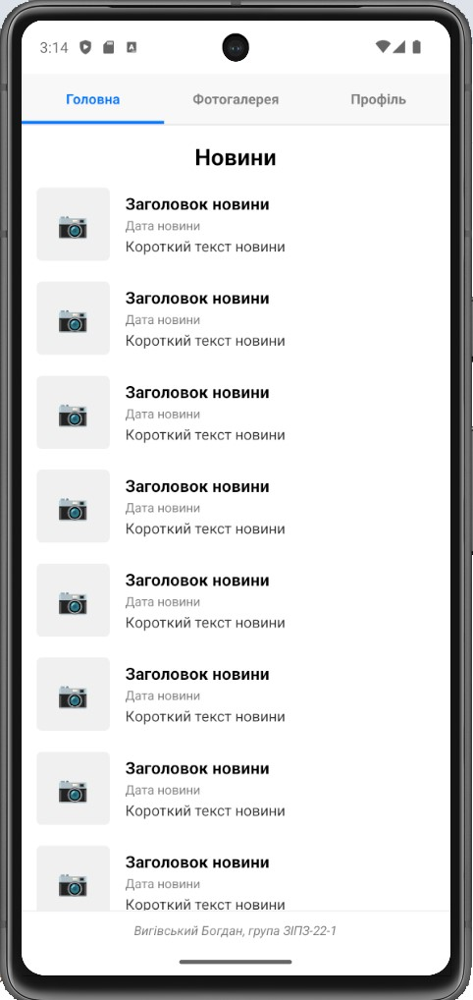
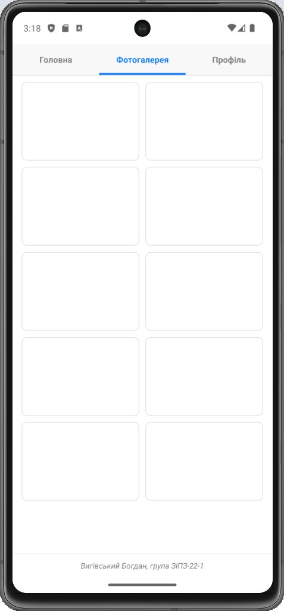
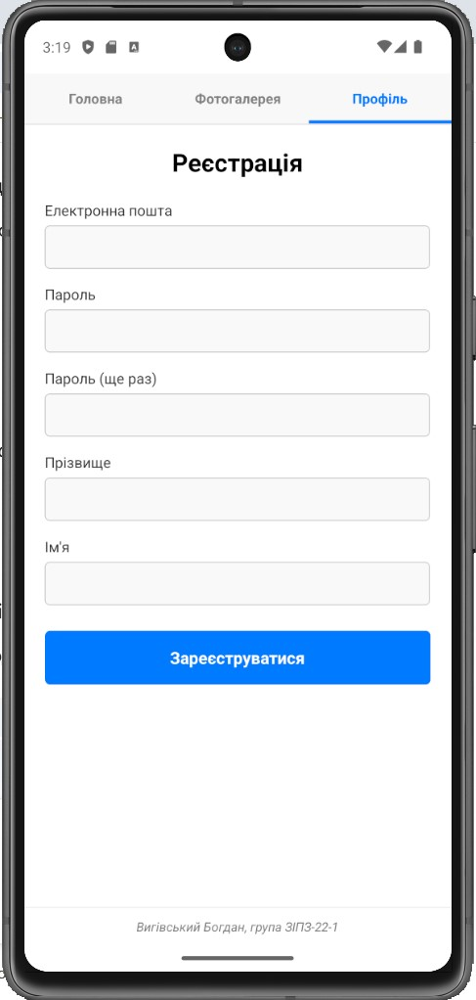

# Лабораторна робота №1: Базова навігація (Material Top Tabs)

**Виконав:** Вигівський Богдан, група ЗІПЗ-22-1  
**Дисципліна:** Розробка мобільних додатків

## Опис завдання
Створення базового мобільного застосунку з використанням React Native та Expo.
Реалізовано навігацію на основі `@react-navigation/material-top-tabs` із трьома екранами:
1. **Головна:** список новин (використано оптимізований компонент `FlatList`).
2. **Фотогалерея:** відображення зображень у вигляді сітки з 2 колонок (`numColumns={2}`).
3. **Профіль:** форма реєстрації з полями введення (`TextInput`) та кнопкою (`TouchableOpacity`).

## Інструкція із запуску
Щоб запустити проєкт локально, виконайте наступні кроки у терміналі:

1. Перейдіть у папку першої лабораторної роботи:
   ```bash
   cd lab1
   
2. Встановіть усі необхідні залежності:
   ```bash
   npm install
   
3. Запустіть локальний сервер (Metro Bundler):
   ```bash
   npx expo start
   
4. Натисніть a у терміналі для запуску додатка на Android-емуляторі або відскануйте згенерований QR-код за допомогою додатка Expo Go на вашому фізичному смартфоні.

## Скріншоти виконання результату

**1. Головна сторінка (Новини)**


**2. Фотогалерея**


**3. Профіль (Форма реєстрації)**
