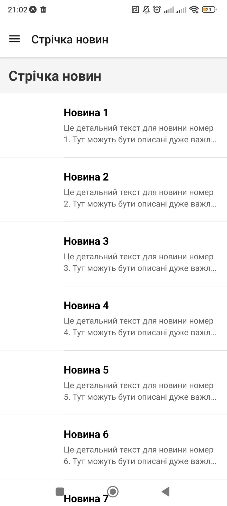
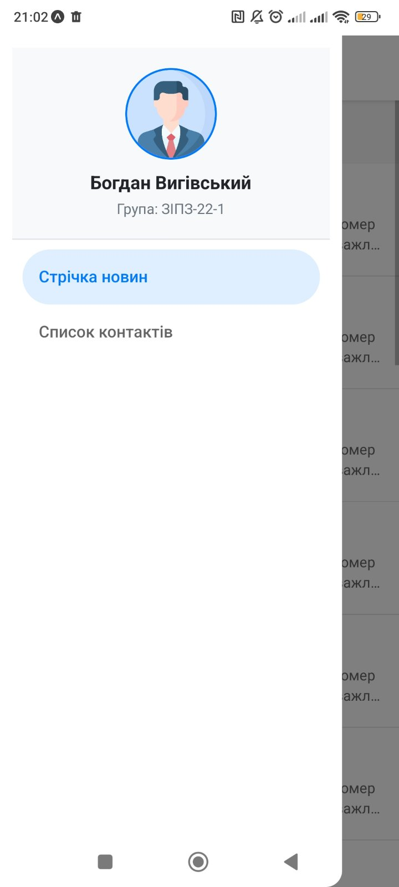
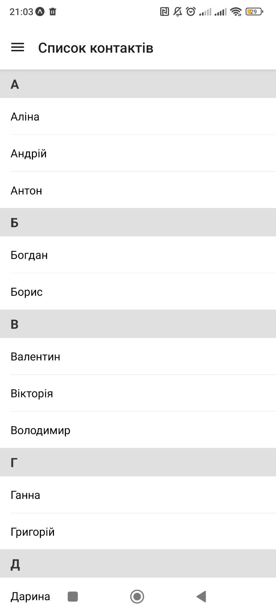

# Лабораторна робота №2: Побудова навігації та списків у React Native

**Виконав:** Богдан Вигівський (група ЗІПЗ-22-1)

## 1. Інструкція запуску
1. Клонувати репозиторій: `git clone <посилання_на_ваш_репозиторій>`
2. Перейти в папку проєкту: `cd lab2`
3. Встановити залежності: `npm install --legacy-peer-deps`
4. Запустити проєкт: `npx expo start -c`
5. Відсканувати QR-код через додаток Expo Go на смартфоні або натиснути `a` для запуску на Android-емуляторі.

## 2. Опис реалізованого функціоналу
* **Вкладена навігація:** Реалізовано `Drawer Navigator` як головне меню, всередині якого працює `Stack Navigator` для переходу між списком новин та їх деталями.
* **Кастомне меню:** Створено компонент `CustomDrawer` з відображенням фотографії, ПІБ та групи користувача.
* **Стрічка новин (FlatList):** Оптимізований список із налаштуваннями віртуалізації (`initialNumToRender`, `windowSize` тощо). Реалізовано імітацію завантаження даних за допомогою pull-to-refresh (`onRefresh`) та infinite scroll (`onEndReached`).
* **Список контактів (SectionList):** Реалізовано відображення згрупованих за алфавітом контактів із закріпленням заголовків секцій під час скролінгу (`stickySectionHeadersEnabled`).

## 3. Скріншоти роботи застосунку

## 4. Висновки (Відповіді на контрольні запитання)

**1. Чим відрізняється FlatList від ScrollView?**
`ScrollView` рендерить абсолютно всі елементи, які знаходяться всередині нього, одразу при завантаженні екрану. Якщо список великий, це призводить до значних витрат пам'яті та падіння продуктивності. `FlatList` використовує механізм віртуалізації: він рендерить лише ті елементи, які зараз видно на екрані (плюс невеликий буфер), видаляючи з пам'яті невидимі елементи.

**2. Що таке віртуалізація списків?**
Це техніка оптимізації рендерингу великих наборів даних. Замість того, щоб створювати UI-компоненти для тисяч елементів одночасно, система відображає лише видимі на екрані, а компоненти, що вийшли за межі видимості, перевикористовуються для нових елементів, які з'являються під час скролінгу.

**3. Як здійснюється передача параметрів між екранами?**
Передача здійснюється під час виклику функції навігації у вигляді об'єкта: `navigation.navigate('НазваЕкрану', { параметр: значення })`. На цільовому екрані ці дані отримуються через пропси (найчастіше хук або об'єкт `route`): `const { параметр } = route.params;`.

**4. Що таке вкладена навігація?**
Це архітектурний підхід, при якому один тип навігатора розміщується (вкладається) всередині іншого. Наприклад, коли одним з екранів бокового меню (`Drawer Navigator`) є цілий стек екранів (`Stack Navigator`), що дозволяє комбінувати глобальну навігацію застосунку з локальними переходами "вглиб".

**5. У яких випадках застосовується SectionList?**
`SectionList` застосовується тоді, коли дані мають чітку ієрархічну або згруповану структуру, і їх потрібно відобразити з логічними роздільниками (заголовками секцій). Наприклад: список контактів (згрупований за алфавітом), розклад занять (згрупований за днями тижня) або список покупок (згрупований за категоріями товарів).