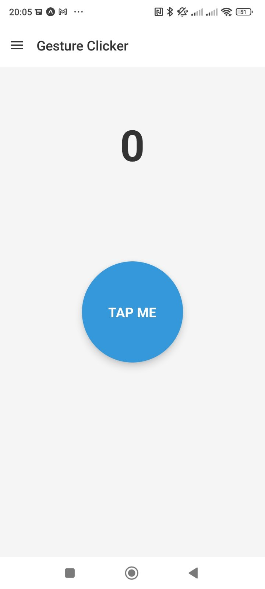
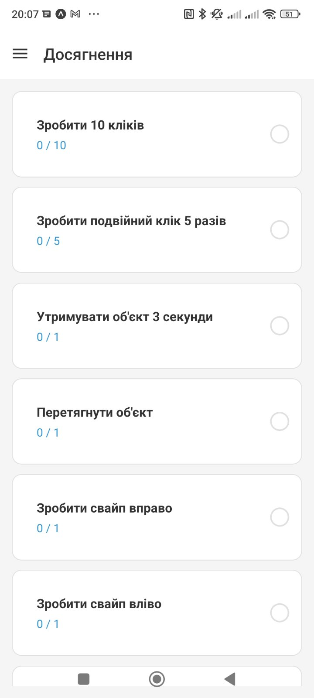
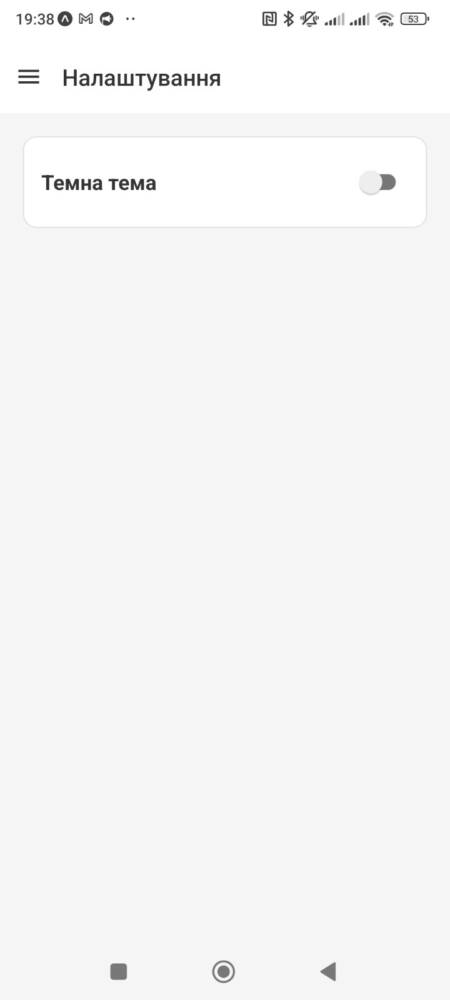
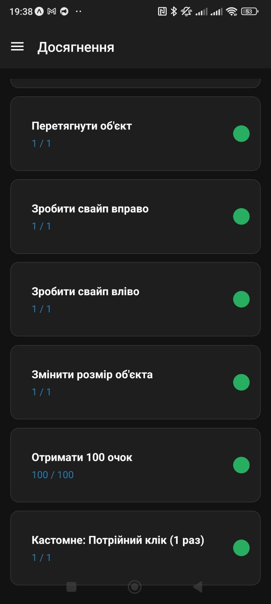

# Лабораторна робота №3: Використання кастомних жестів у React Native та стилізація інтерфейсу 

**Виконав:** Богдан Вигівський (група ЗІПЗ-22-1)

## 1. Інструкція запуску
1. Клонувати репозиторій: `git clone <посилання_на_ваш_репозиторій>`
2. Перейти в папку проєкту: `cd lab3`
3. Встановити залежності: `npm install`
4. Здійснити вирівнювання версій пакетів (за необхідності): `npx expo install --fix`
5. Запустити проєкт із чистим кешем: `npx expo start -c`
6. Відсканувати QR-код через додаток Expo Go на смартфоні або натиснути `a` для запуску на Android-емуляторі.

## 2. Опис реалізованого функціоналу
* **Кастомні жести (react-native-gesture-handler):** Реалізовано обробку складних жестів на ігровому об'єкті:
    - Одинарні та подвійні натискання (`Tap`).
    - Утримання (`LongPress` на 3 секунди).
    - Перетягування (`Pan`) з анімацією повернення (`withSpring`).
    - Свайпи вправо та вліво (`Fling`).
    - Масштабування двома пальцями (`Pinch`).
    - **Кастомне завдання:** Потрійний клік для отримання підвищеної кількості балів. Вирішено конфлікти між кліками за допомогою `Gesture.Exclusive` та налаштовано одночасну роботу `Pan` і `Pinch` через `Gesture.Simultaneous`.
* **Глобальний стан (Context API):** Створено `GameContext`, який відстежує загальний рахунок (score), перевіряє прогрес виконання завдань (челенджів) та робить ці дані доступними на всіх екранах.
* **Стилізація та теми (Styled Components):** Інтерфейс побудовано з використанням `styled-components`. Реалізовано кольорові палітри для світлої та темної тем. Перемикання тем здійснюється на екрані "Налаштування", після чого `ThemeProvider` динамічно оновлює вигляд усього застосунку.
* **Навігація:** Використано `@react-navigation/drawer` для створення бокового меню і зручного переходу між Клікером, Досягненнями та Налаштуваннями.

## 3. Скріншоти роботи застосунку

## 4. Висновки 

Під час виконання лабораторної роботи було здобуто та закріплено практичні навички обробки жестів користувача та стилізації інтерфейсів у React Native.

У результаті розробки мобільного додатка (гри-клікера) було реалізовано:
1. **Взаємодію через різні типи жестів:** За допомогою бібліотеки `react-native-gesture-handler` налаштовано розпізнавання як базових (Tap, LongPress), так і складних користувацьких дотиків (Pan, Fling, Pinch). Успішно реалізовано паралельне виконання жестів (через `Gesture.Simultaneous`) та вирішено конфлікти їх пріоритетності (за допомогою `Gesture.Exclusive`). Це забезпечило плавну та надійну реакцію об'єктів без затримок.
2. **Сучасні підходи стилізації:** Інтерфейс застосунку побудовано за допомогою `styled-components`. Це дозволило створити ізольовані, багаторазово використовувані UI-компоненти та успішно впровадити динамічну зміну кольорової палітри (світла/темна тема) на рівні всього додатка завдяки `ThemeProvider`.
3. **Глобальне управління станом:** Для відстеження прогресу гри та виконаних завдань (челенджів) на різних екранах застосовано `Context API`, що забезпечило зручну синхронізацію даних без надмірного використання пропсів (props drilling).