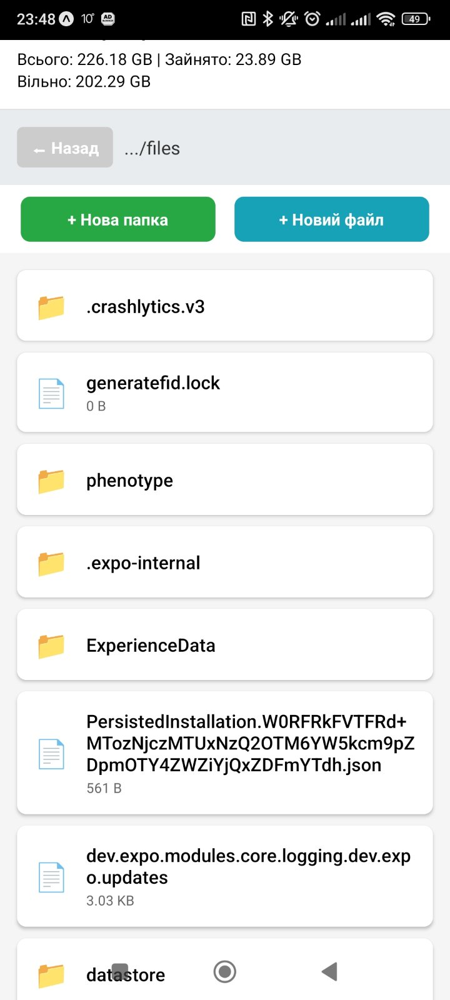
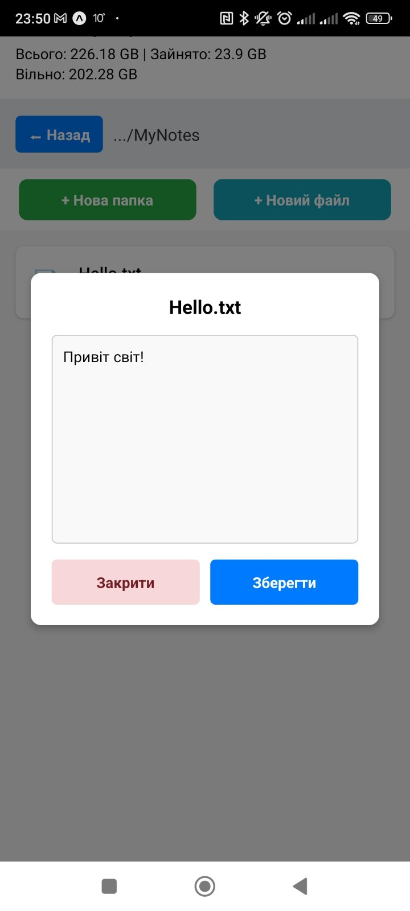
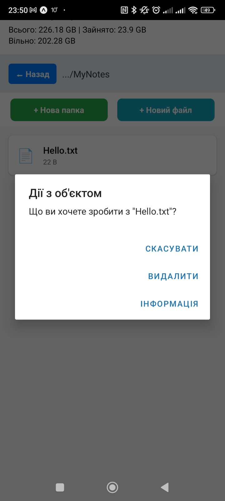

# Лабораторна робота №4: Робота з файловою системою в React Native (OOP API)

**Виконав:** Богдан Вигівський (група ЗІПЗ-22-1)

## 1. Інструкція запуску
1. Клонувати репозиторій: `git clone https://github.com/bohdan-zt/MobileLabsRN2026.git`
2. Перейти в папку проєкту: `cd lab4`
3. Встановити залежності: `npm install` та `npx expo install expo-file-system`
4. Запустити проєкт: `npx expo start -c`
5. Відсканувати QR-код через додаток Expo Go на смартфоні або натиснути `a` для запуску на Android-емуляторі.

## 2. Опис реалізованого функціоналу
* **Моніторинг пам'яті:** Реалізовано відображення загальної та доступної пам'яті пристрою за допомогою `Paths.totalDiskSpace` та `Paths.availableDiskSpace`.
* **ООП-навігація:** Використано об'єктно-орієнтований підхід класів `Directory` та `File`. Додаток стартує з безпечної директорії `Paths.document`. Кнопка "Назад" працює через властивість `parentDirectory`.
* **Створення об'єктів:** Реалізовано модальні вікна для створення нових папок (`new Directory().create()`) та текстових файлів (`new File().write()`).
* **Читання та Редагування:** При натисканні на файл зчитується його вміст (`item.text()`), який можна відредагувати у модальному вікні та перезаписати.
* **Метадані та Видалення:** Налаштовано обробку довгого натискання (`onLongPress`), яка викликає меню з можливістю переглянути детальну інформацію (`item.info()`) або безповоротно видалити об'єкт (`item.delete()`).

## 3. Скріншоти роботи застосунку

## 4. Висновки

Під час виконання лабораторної роботи було здобуто практичні навички взаємодії з локальною файловою системою мобільних пристроїв через новий об'єктно-орієнтований API бібліотеки `expo-file-system`.

У результаті розробки "Файлового менеджера" було засвоєно:
1. **ООП-архітектуру `expo-file-system`:** Відмова від старих процедурних методів на користь роботи з екземплярами класів `File` та `Directory`, що значно спрощує маніпуляції зі шляхами, читанням та записом.
2. **Управління зонами зберігання:** Опановано різницю між волатильними даними (`Paths.cache`, які ОС може видалити) та персистентними (`Paths.document`, де ми зберігаємо надійні користувацькі файли).
3. **Запобігання Crash-помилкам:** Опрацьовано механізми попередньої перевірки вільної пам'яті (`availableDiskSpace`) для уникнення помилки `ENOSPC`, а також теоретичні основи використання `FileHandle` та Web Streams для потокового читання великих файлів (запобігання переповненню RAM - OOM).